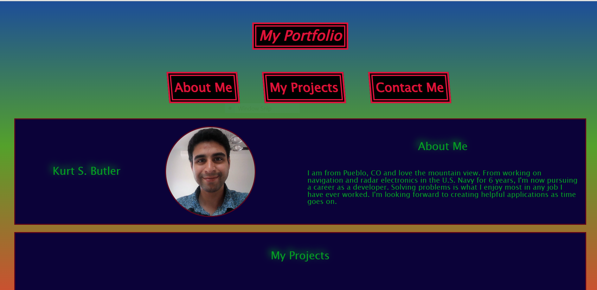
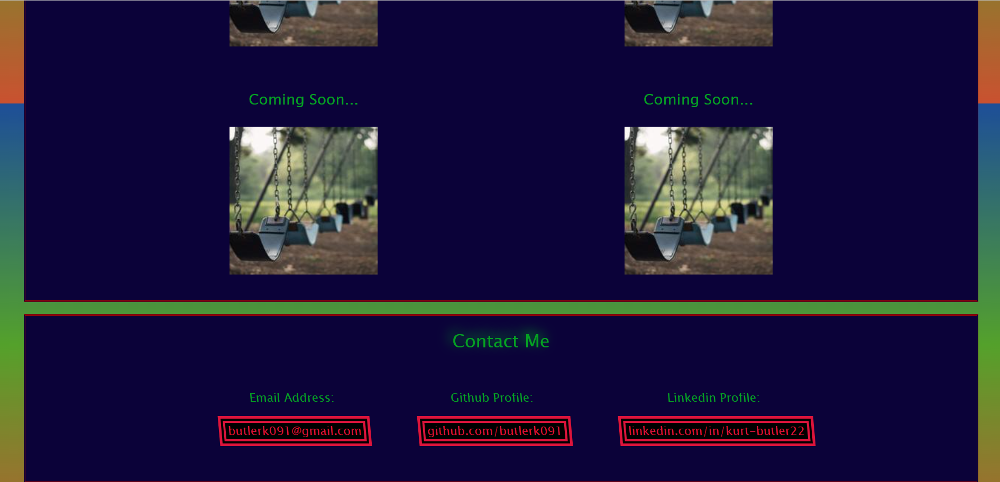
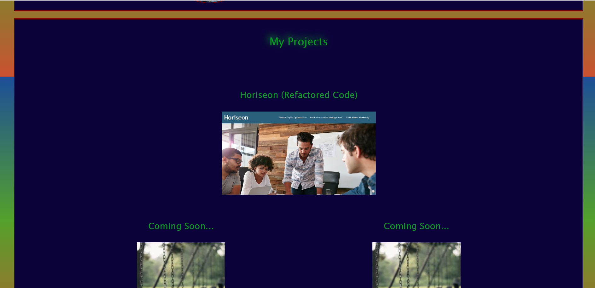

# my-portfolio

## Description

 As a student within a coding boot-camp course, I have put together this web application as a means to show case my skills as a developer in the making. I used a variation of what I have recently learned about flex-box, media-queries, and many more css styling rules to create a portfolio with a responsive viewport design. My portfolio webpage is structured with a combination of HTML semantics and attributes. Using flex-box within media-queries is very helpful in getting content right where you would like it when viewed from different screen sizes.

## Installation

N/A

## Usage

Use this web application to view my projects, contact me, and get to know a little about where I am from and what I had recently been doing prior to shifting gears towards coding. You could also use this web application to understand how to successfully use flex-box within a media-query, border-styling, and other css styling rules. 

## Credits

All temporary images used in the project section were pulled from: https://unsplash.com/.
